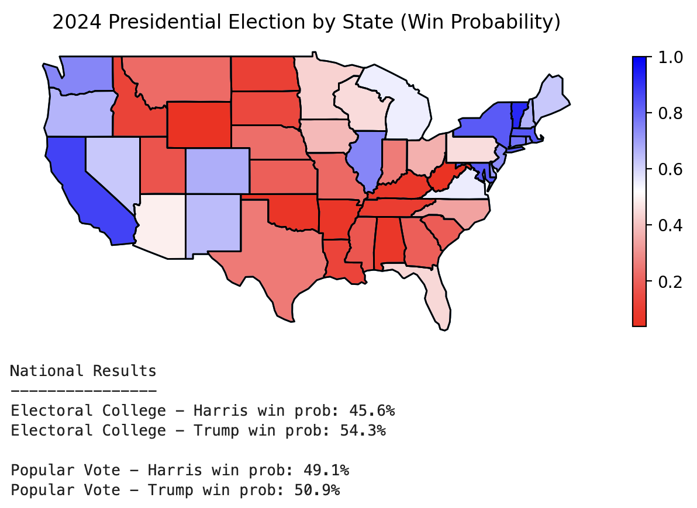

# us-election-model

The goal of this project is to create a *simple*, robust model to predict state-level presidential election results (and overall result) from polling data, while accounting for systematic errors across states and elections. The model incorporates both state-specific *fixed* effects and national-level *random* effects to capture deviations from expected vote shares.

## Model Predictions

Here we assume Kamala at 52% in the polls and trump 48% (this tracks the average of current polls, after rescaling to 100% total)

## The Model

To model the vote share, we use hierarchical bayesian logistic regression. In our model, the predicted vote share for democrats, $p_{s,t}$ for state $s$ in election $t$ is given by:
     
$$p_{s,t} = \text{logistic}(\text{logit}(X_{t}) + \alpha_s + \gamma_t)$$

where $X_{t}$ represents the national polling data for that year (e.g. $X_{t} = 54$%), $\alpha_s$ is the state-specific voting propensity (fit over many years), and $\gamma_t$ is the national-level polling error for election $t$. Given we are assuming only two candidates, probability for Republican candidates is just: $1 - p_{s,t}$

In short, we assume the national polling data will represent the outcome for each state (e.g. if  $\alpha_s$ + $\gamma_t$ are set to zero, then $p_{s,t}$ just returns the input polls, $X_{t}$). We then adjust this with our fixed and random effects to make our state-level prediction:
- The state-specific effect $\alpha_s$ is a **fixed effect** (i.e. is assumed to be constant over all years). This captures the propensity of states to vote more democrat or republican (e.g. for Texas this will skew republican and California skew democrat).
- The polling error $\gamma_t$ is assumed to be a normally distributed **random effect** (not state specific), hence this changes each year. This should capture whether polls are systematically wrong for a particular year.

The observed vote share $y_{s,t}$ is modeled using a normal distribution centered around the predicted vote share $p_{s,t}$ as follows:

$$y_{s,t} \sim \mathcal{N}(p_{s,t}, \sigma_{vote}^2)$$

The idea here is to account for any other random errors in the results (not correlated across states). In Logistic regression you might often use something like bernoulli error, however since the error to counts will be tiny here, the thing we really want to model are werid messy systematic effects not captured by other components of the model. The normal distribution can capture this.

### Time-Varying Model

I also implemented a time-varying model, which instead of just fitting $\alpha_s$, we also fit for a time-varying effect (e.g. states becoming more democrat or republican over time), so this becomes $\alpha_{s,t} = \alpha_{s,0} + \delta_{s} \cdot t$, so the model becomes:

$$p_{s,t} = \text{logistic}(\text{logit}(X_{t}) + \alpha_{s,0} + \delta_{s} \cdot t + \gamma_t)$$

where $\delta_{s,t}$ represents the strength of the increase or decrease in $\alpha$ over time. All other components of the model remain the same. This is the model I currently am using in production, since it appears to produce more realistic esitmates, and it doesn't seem like I have any issues with too many parameters.

### Generating Predictions

Given out fitted model, we can sample from our posteriors to generate possible election results. To generate our full results, we do this many times ($\sim 10,000$), and compute how many times each state is won by each candidate. 

To generate overall win probabilities, we work out electoral college votes for each candidate in each draw, and compute the fraction of times each candidate wins the presidential election. 

## Data

The model is trained on historical national polling data (as its input) and fit to historical vote shares in each state. 

We fit only from 1976 onwards for a few reasons. Partly, this is a point we can easily extract reliable data, but also, shortly before this not all states could vote (e.g. Alaska, Hawaii), and additionally populations might not well represent the current voter base. We feel this is a sensible Compromise between data size and relevance. We also remove 1992 and 1996 due to a large number of votes for a 3rd candidate here which significantly complicates the voting. This leaves us with 10 election years. 

`data/` contains historical polling and results data, which I have cleaned up for use in a model: 
- Historical polling data is scraped from [this wikipedia article](https://en.wikipedia.org/wiki/Polling_for_United_States_presidential_elections).
- State-level results are extracted from [Harvard's U.S. President 1976-2020 dataset](https://dataverse.harvard.edu/dataset.xhtml?persistentId=doi:10.7910/DVN/42MVDX&version=8.0). (Try [this link](https://dataverse.harvard.edu/dataverse/medsl_election_returns) incase the previous dataset changes post-2024 election)

In `data/`:
- `data/historical_polling_oct_nov.csv` contains the average of all october and november national polls for each year (after removing independants and rescaling)
- `data/historical_state_results.csv` contains one row per state per year showing the republican and democrat actual votes share (also after removing independants and rescaling). Also contains some other useful information like canndidate names, state codes, total state votes etc.
- `data/electoral_college_votes.csv containg one row per state with the number of electoral college votes 
allocated to each state`

## The Code
